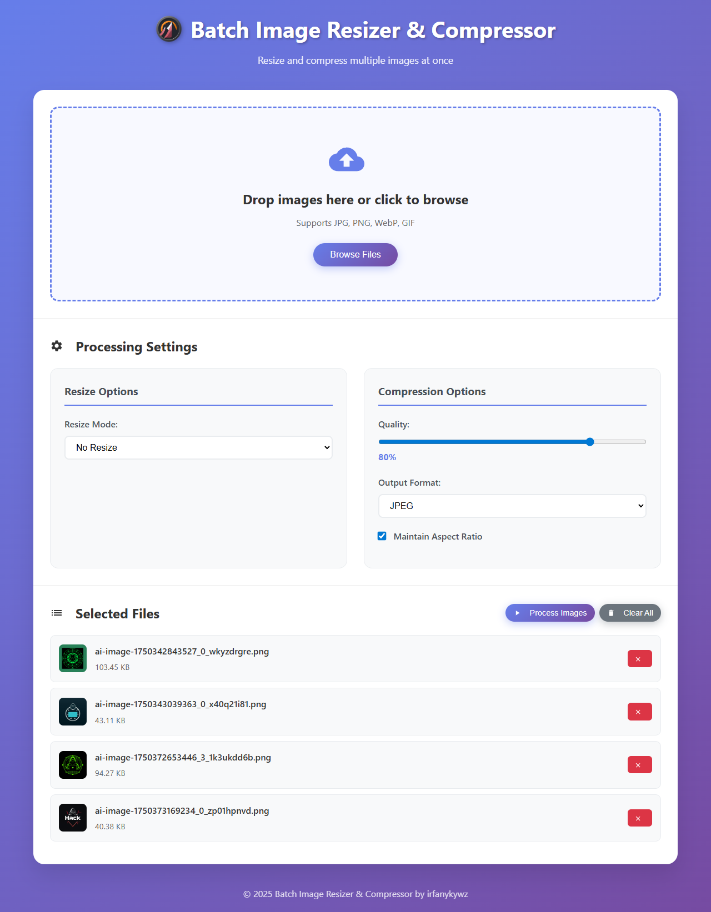

# Batch Image Resizer & Compressor

A modern, responsive web application for batch processing images with resizing and compression capabilities. All processing is done locally in your browser - no files are uploaded to any server.



## Features

### 🖼️ **Image Processing**
- **Batch Processing**: Process multiple images at once
- **Multiple Formats**: Support for JPG, PNG, WebP, and GIF
- **Resize Options**:
  - No resize (compression only)
  - Percentage scaling
  - Specific dimensions
  - Maximum width/height constraints
- **Compression Control**: Adjustable quality settings (1-100%)
- **Format Conversion**: Convert between different image formats
- **Aspect Ratio**: Option to maintain original aspect ratio

### 🎨 **User Interface**
- **Modern Design**: Beautiful gradient background with clean UI
- **Drag & Drop**: Intuitive file upload with visual feedback
- **Responsive**: Works perfectly on desktop, tablet, and mobile
- **Real-time Preview**: See your images before and after processing
- **Progress Tracking**: Visual progress bar during processing
- **Notifications**: User-friendly feedback messages

### 📊 **Results & Analytics**
- **Compression Stats**: See file size reduction percentages
- **Before/After Comparison**: Visual comparison of original vs processed
- **Batch Summary**: Total compression statistics
- **Individual Downloads**: Download each processed image separately
- **Batch Download**: Download all processed images at once

## How to Use

### 1. **Upload Images**
- Drag and drop images onto the upload area, or
- Click "Browse Files" to select images from your device
- Supported formats: JPG, PNG, WebP, GIF

### 2. **Configure Settings**
- **Resize Mode**: Choose how you want to resize images
  - **No Resize**: Only compress without changing dimensions
  - **Percentage**: Scale by a percentage (e.g., 50% = half size)
  - **Specific Dimensions**: Set exact width and height in pixels
  - **Max Width**: Limit maximum width while maintaining aspect ratio
  - **Max Height**: Limit maximum height while maintaining aspect ratio

- **Compression Settings**:
  - **Quality**: Adjust compression level (1-100%)
  - **Output Format**: Choose JPEG, PNG, or WebP
  - **Maintain Aspect Ratio**: Keep original proportions when resizing

### 3. **Process Images**
- Click "Process Images" to start batch processing
- Watch the progress bar as images are processed
- View real-time processing status

### 4. **Download Results**
- Review compression statistics and file size reductions
- Download individual images or all at once
- Start a new batch when finished

## Technical Details

### **Browser Compatibility**
- Modern browsers with Canvas API support
- Chrome, Firefox, Safari, Edge (latest versions)
- Mobile browsers supported

### **Privacy & Security**
- **100% Local Processing**: No files uploaded to servers
- **No Data Collection**: Your images never leave your device
- **Client-side Only**: All processing happens in your browser

### **Performance**
- **Efficient Processing**: Uses HTML5 Canvas for image manipulation
- **Memory Management**: Processes images one at a time to avoid memory issues
- **Progress Feedback**: Real-time updates during processing

## File Structure

```
image-compressor/
├── index.html          # Main HTML structure
├── styles.css          # CSS styles and responsive design
├── script.js           # JavaScript functionality
├── favicon.ico         # Application icon
├── start.bat           # Windows batch file for easy startup
├── spark.exe           # Local server executable
└── README.md           # This documentation
```

## Quick Start

### Option 1: Direct File Opening
1. Simply open `index.html` in your web browser
2. Start uploading and processing images immediately

### Option 2: Local Server (Recommended)
1. Double-click `start.bat` to launch the local server
2. The application will open automatically in your default browser
3. Enjoy the full functionality with proper file handling

## Advanced Usage

### **Batch Processing Tips**
- **Large Batches**: Process images in smaller batches for better performance
- **Format Selection**: Use WebP for best compression, JPEG for compatibility
- **Quality Settings**: Start with 80% quality for good balance of size and quality

### **Resize Strategies**
- **Web Optimization**: Use "Max Width" with 1920px for web images
- **Thumbnail Creation**: Use "Specific Dimensions" for consistent thumbnails
- **Mobile Optimization**: Use "Max Width" with 800px for mobile-friendly images

### **Compression Guidelines**
- **High Quality (90-100%)**: For photos and detailed images
- **Medium Quality (70-89%)**: For general web use
- **Low Quality (50-69%)**: For thumbnails and previews
- **Very Low Quality (1-49%)**: For extreme compression needs

## Browser Support

| Browser | Version | Status |
|---------|---------|--------|
| Chrome | 60+ | ✅ Full Support |
| Firefox | 55+ | ✅ Full Support |
| Safari | 12+ | ✅ Full Support |
| Edge | 79+ | ✅ Full Support |
| IE | 11 | ⚠️ Limited Support |

## Troubleshooting

### **Common Issues**

**Images not uploading?**
- Check that files are valid image formats (JPG, PNG, WebP, GIF)
- Ensure browser supports File API

**Processing is slow?**
- Reduce batch size for large numbers of images
- Close other browser tabs to free up memory
- Use lower quality settings for faster processing

**Download not working?**
- Check browser download settings
- Ensure pop-up blockers are disabled
- Try downloading individual files instead of batch

**Canvas errors?**
- Update to latest browser version
- Check if hardware acceleration is enabled
- Try processing smaller images first

## Development

### **Local Development**
1. Clone or download the project files
2. Open `index.html` in a web browser
3. Use browser developer tools for debugging

### **Customization**
- Modify `styles.css` for visual changes
- Edit `script.js` for functionality changes
- Update `index.html` for structural changes

### **Adding Features**
The modular code structure makes it easy to add new features:
- New resize modes in `calculateNewDimensions()`
- Additional output formats in `processImage()`
- Custom UI elements in the HTML structure

## License

This project is open source and available under the MIT License. Feel free to use, modify, and distribute as needed.

## Contributing

Contributions are welcome! Please feel free to submit issues, feature requests, or pull requests.

---

**Enjoy your batch image processing! 🚀** 